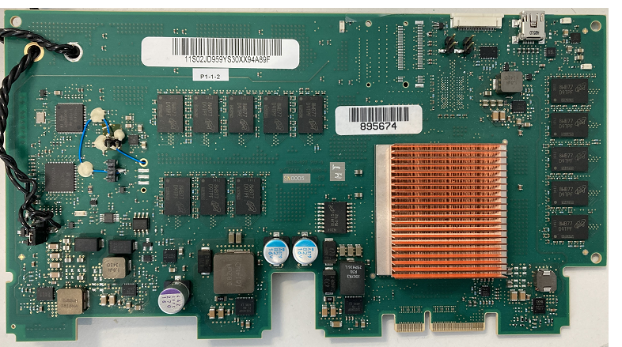

# Gemini Description

## Description

Gemini is a development card hosting an [ICE OMI device side FPGA reference design](../ice/) and connected to a server DIMM connector.

It enables attachment of a DDR4 memory through OMI.

It was developed for use in doing post-silicon validation of a CPU that has OMI near memory controller implementations.

